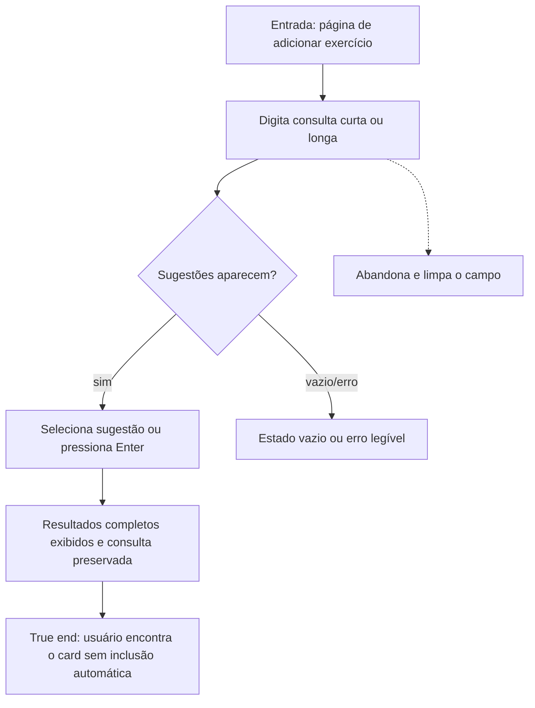

```yaml
journey:
  id: J-exercise-search
  name: Pesquisar exercício
  value_statement: "Encontrar um exercício no catálogo e visualizar seu card sem adicioná-lo por engano"
  personas: [Usuário de teclado, Usuário mobile]
  entry_points:
    - url: http://localhost:3000/treinos/<dia>/adicionar-exercicio
      origin: in-app-nav
  goal:
    observable: "Resultados completos aparecem e o nome pesquisado permanece no Combobox"
    side_effects: []
  true_end_state: "O card do exercício está visível e nenhuma mutação de adição ocorreu"
  exit:
    natural: "Usuário pode adicionar pelo botão do card ou iniciar nova busca"
  abandonment:
    - at_step: 2
      how: "Usuário clica em Limpar busca"
      resume: "Campo vazio e pronto para nova pesquisa"
  crosses: [frontend, GET /api/exercises]
```
