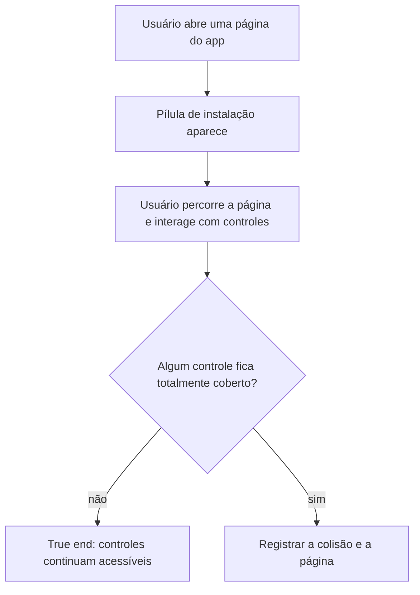

```yaml
journey:
  id: J-pwa-install-position
  name: Usar páginas com a pílula de instalação visível
  value_statement: "Interagir com as páginas sem perder acesso a controles por causa da pílula"
  personas: [Usuário mobile]
  entry_points:
    - url: http://localhost:3000/
      origin: in-app-nav
    - url: http://localhost:3000/treinos/<dia>/adicionar-exercicio
      origin: in-app-nav
  goal:
    observable: "Nenhum controle importante fica totalmente coberto pela pílula"
    side_effects: []
  true_end_state: "Páginas e controles continuam acessíveis com a pílula visível"
  exit:
    natural: "Usuário continua a tarefa ou dispensa a pílula"
  abandonment: []
  crosses: [frontend]
```
